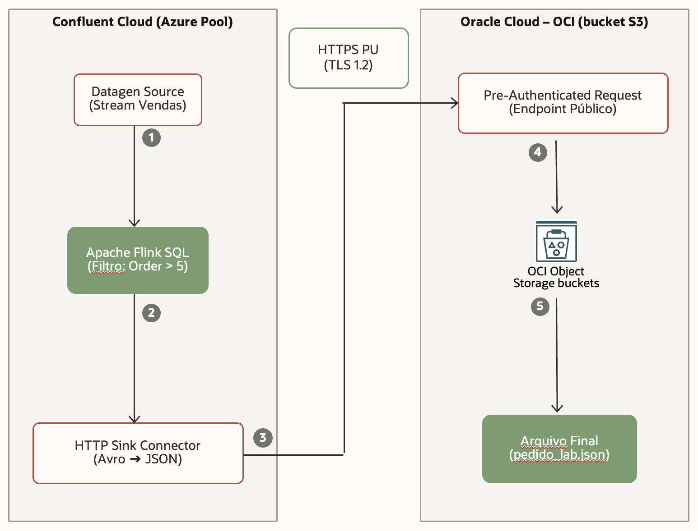
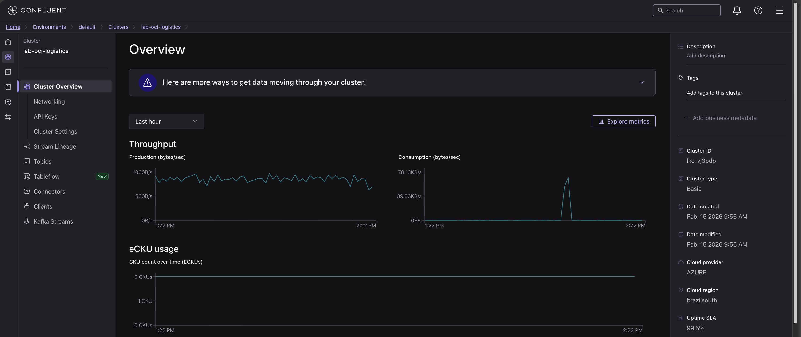
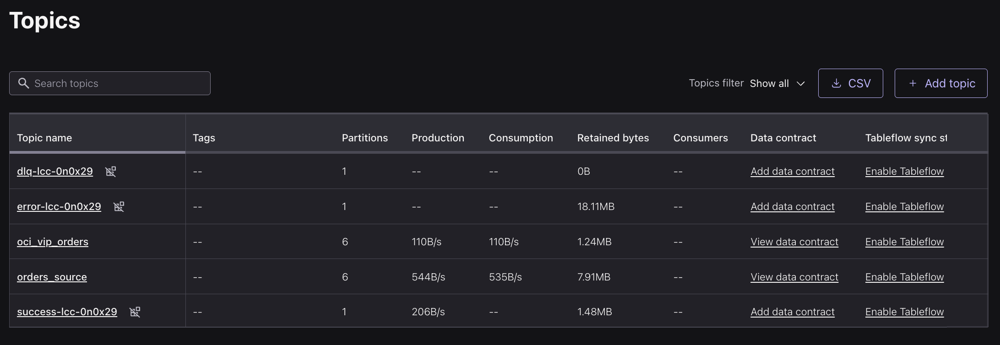
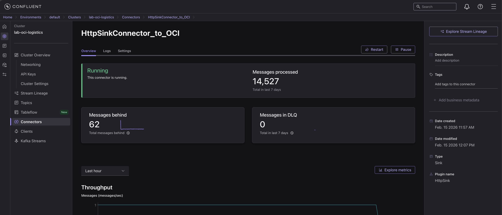
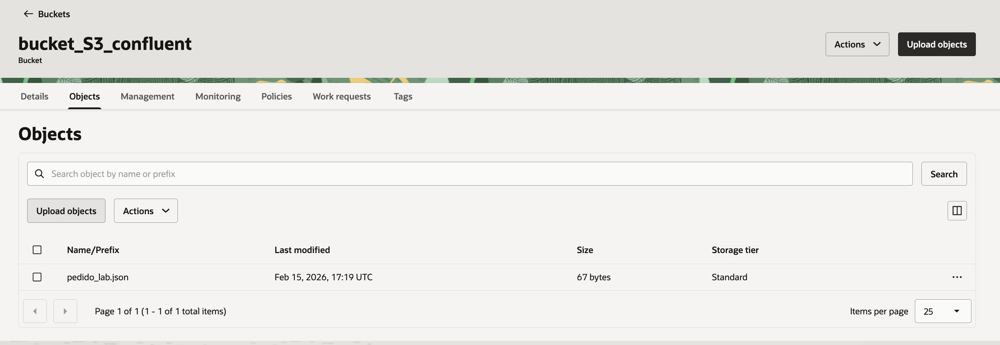

# Multicloud Real‑Time Ingestion (Confluent Cloud on Azure → Oracle Cloud Infrastructure)

**Goal:** validate an enterprise‑grade streaming pattern where **Confluent Cloud** is the real‑time backbone and **OCI Object Storage** is the durable landing zone for downstream analytics and data lake ingestion.

This repo is intentionally **managed‑services only**:
- No VMs
- No Kubernetes
- No custom microservices
- Streaming + storage, with clear operational evidence

---

## Architecture at a glance



---

## What’s implemented

### 1) Event generation (source)
- Synthetic order events generated via **Faker** into a Kafka topic (Avro-encoded)

### 2) In‑motion processing (Flink SQL)
- A **Flink SQL** job applies business rules while data is “in flight”
- Example: keep only VIP/high-value orders (`order_total > 5`) and write to a curated topic

### 3) Delivery to OCI (Kafka Connect)
- A managed **HTTP Sink Connector** delivers curated events to OCI via **HTTPS**
- Payload is delivered as **JSON** to an **Object Storage Pre‑Authenticated Request (PAR)** endpoint

### 4) Durable landing zone (OCI Object Storage)
- Objects land in a bucket as JSON files (example: `pedido_lab.json`)
- This pattern is a clean handoff to:
  - Data Lake ingestion
  - Batch analytics
  - Downstream ETL/ELT pipelines

---

## Why this pattern is “enterprise”

**Separation of concerns**
- Streaming layer handles real‑time transport and operational guarantees
- Storage layer handles durability, retention, and downstream consumption

**Managed operations**
- Confluent Cloud provides operational controls (throughput, CKU, connector health, DLQ)
- OCI Object Storage provides durable storage with lifecycle policies and cost tiers

**Security posture**
- No credentials embedded in code
- Delivery uses **HTTPS** and **OCI PAR** (time‑bound access to a specific object/bucket path)

---

## Repo structure

```
.
├── README.md
├── images/
│   ├── architecture.png              # add your architecture diagram here
│   ├── cluster_overview.png
│   ├── topics_overview.png
│   ├── http_sink_running.png
│   └── oci_bucket_object.png
├── config/
│   └── http_sink_connector.json      # connector configuration (sanitized)
└── src/
    ├── 01_source_faker.sql           # creates source + sample generator
    ├── 02_sink_table.sql             # defines the sink/curated stream/table
    └── 03_process_logic.sql          # business rule (filtering/transform)
```

---

## How to run (high level)

1. **Create Confluent Cloud resources**
   - Cluster (Azure region)
   - API keys
   - Topics (source + curated)

2. **Create Flink SQL statements**
   - Run scripts in `src/` in order:
     - `01_source_faker.sql`
     - `02_sink_table.sql`
     - `03_process_logic.sql`

3. **Create the HTTP Sink Connector**
   - Use `config/http_sink_connector.json`
   - Point it to your OCI Object Storage **PAR endpoint**
   - Validate connector status and task health

4. **Validate delivery to OCI**
   - Confirm objects created in your bucket
   - Confirm payload format and expected filtering behavior

---

## Operational evidence (screenshots)

### Confluent cluster running


### Topic‑level validation


### HTTP Sink Connector running


### Object landed in OCI


---

## Notes on reliability and troubleshooting

- **DLQ:** keep DLQ enabled for malformed messages or transient failures
- **Idempotency:** when writing to Object Storage, prefer deterministic object keys (if/when supported) to avoid duplicates
- **Schema changes:** treat schema evolution as a first‑class concern (Schema Registry strategy + compatibility settings)
- **TLS issues:** common root causes are endpoint policy, cipher mismatch, or missing CA chain; validate with connector logs

---

## Where this goes next (optional enhancements)

If you want to evolve this into a stronger “solution blueprint”:

- **Object naming strategy** per partition/time window (improves replay and downstream ingestion)
- **Compression** (smaller egress + storage footprint)
- **Lifecycle policies** in OCI (hot → cool → archive)
- **Downstream ingestion** into an OCI lakehouse stack:
  - OCI Data Integration / Data Flow
  - Autonomous Data Warehouse / Lakehouse patterns
  - HeatWave / MySQL analytics, depending on use case

---

## About

Built and documented by **Paulo Magalhães**.  
linkedin: https://www.linkedin.com/in/paulomagalhaes82/
Focus: enterprise cloud architecture, managed streaming, and pragmatic multicloud integration.

